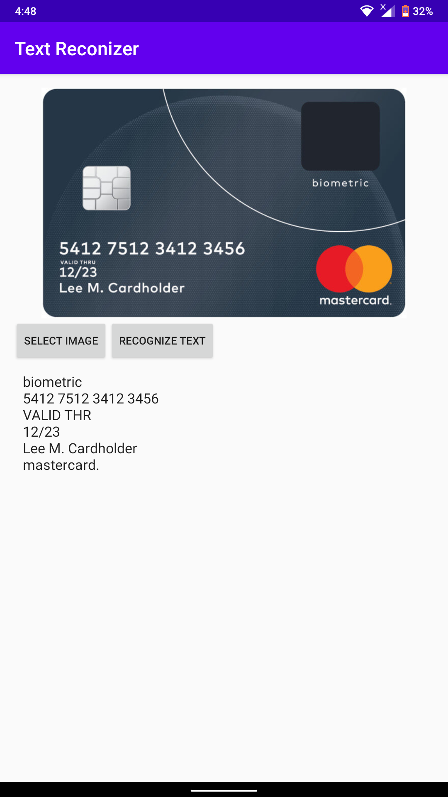

# Text-Recognizer
A Kotlin based Android Application For Text Recognition

# Steps To Access The Project

1) Download and Extract the file (TextRecognizer.zip)

2) Start Android Studio and open mainActivity.kt file. (Kotlin File) also, open the XML File

3) After opening both files i.e. project click on run button application will be run on an emulator

4) Project can be access by using API file. This will help to test application on any Mobile devices.

5) Go to Following Link To Install The Application. 

# Link to Download and Install Application:
https://drive.google.com/file/d/1gVgjIs0eSM6v4lfzRUhTkuzy3xjH-reh/view?usp=sharing
 
# Images 
1) Application View

